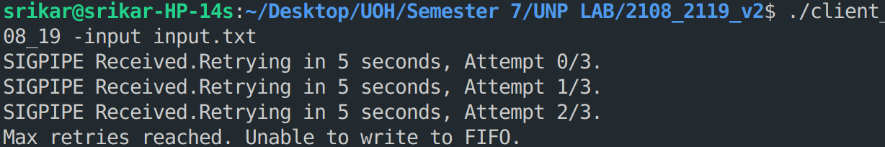
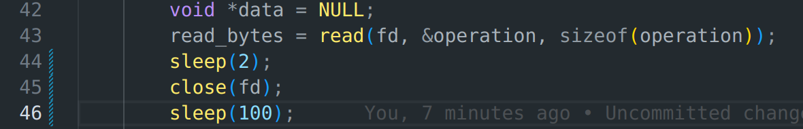

# Student Information System

## Input:

<ul>
    <li>Specify operation to be performed with Student and Course Information.</li>
    <li>For example, refer "input.txt" file.</li>
</ul>

## Output:

<ul>
    <li>Student as well as respective Courses Information into a CSV file <strong>'2108_2119.out'</strong>.</li>
    <li>You can check the end of the file 'logs.txt' to check if any errors or inconsistency is present in the Input file.</li>
</ul>

## Execution Steps:

Run the makefile using the following command:
```
make
```

Open 2 terminals in the project's directory.

Run the following to start the server process:
```
./server_08_19 <SERV_PORT>
```

Run the following to start the client process:
```
./client_08_19 <SERV_IP_ADDR> <SERV_PORT> -input <input_file>
```

## Handling SIGPIPE

When the client encounters a SIGPIPE it retries to write into the FIFO for MAX_RETRIES with RETRY_DELAY between each new write defined in client.c.




To reproduce make the following line changes in server.c




## Modules:

### Client

<ul>
    <li>Store data passed by the parser into a structure.</li>
    <li>Write the Operation and Data to a FIFO.</li>
</ul>

### Parser

<ul>
    <li>Parse the input file.</li>
    <li>Pass the data to the client.</li>
</ul>

### Server

<ul>
    <li>Read and extract data from the FIFO.</li>
    <li>Use the student and course modules to process the Student database information.</li>
    <li>Use the writer module to generate the output and logs files.</li>
</ul>

### Student

<ul>
    <li>Data format and operations on Student information.</li>
    <li>Data Format: <br>&nbsp;&nbsp;&nbsp;&nbsp;&nbsp;Student: Roll Number, Name, CGPA, Number of Subjects, Courses</li>
    <li>Operations:</li>
    <ol>
        <li>addStudent - Input: Roll Number, Name, CGPA, Number of Subjects</li>
        <li>modifyStudent - Input: Roll Number, CGPA</li>
        <li>deleteStudent - Input: Roll Number</li>
        <li>searchStudent - Input: Roll Number</li>
    </ol>
</ul>

### Course

<ul>
    <li>Data format and operations on Course information.</li>
    <li>Data Format: <br>&nbsp;&nbsp;&nbsp;&nbsp;&nbsp;Course: Course Code, Marks</li>
    <li>Operations:</li>
    <ol>
        <li>addStudentCourse - Input: Roll Number, Course Code, Marks</li>
        <li>modifyStudentCourse - Input: Roll Number, Course Code, Marks</li>
        <li>deleteStudentCourse - Input: Roll Number, Course Code</li>
    </ol>
</ul>

### Writer

<ul>
    <li>Write 'Data' and 'Logs' to output files.</li>
</ul>
